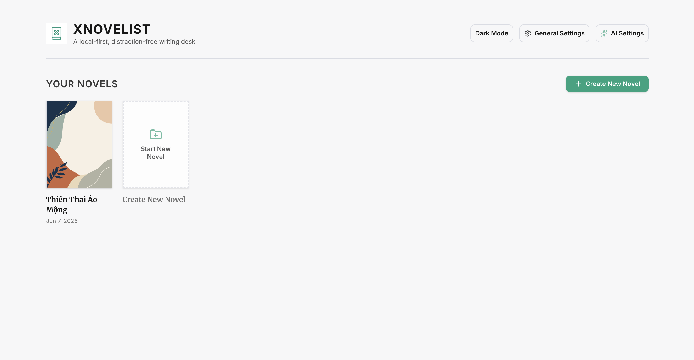
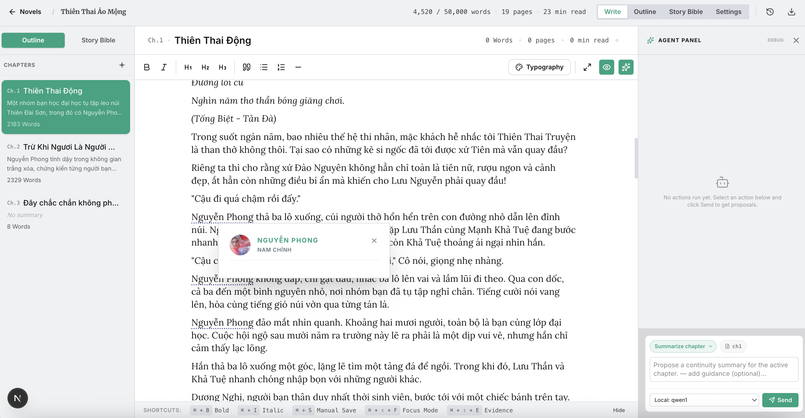
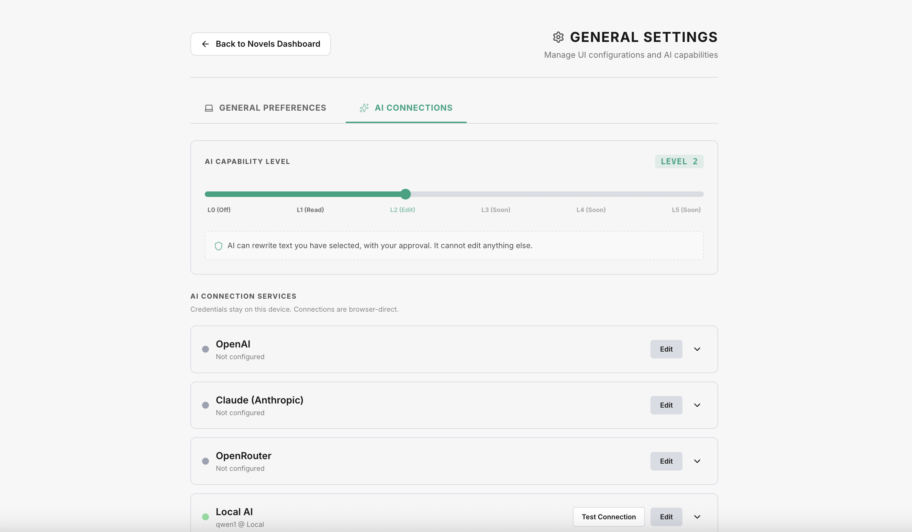
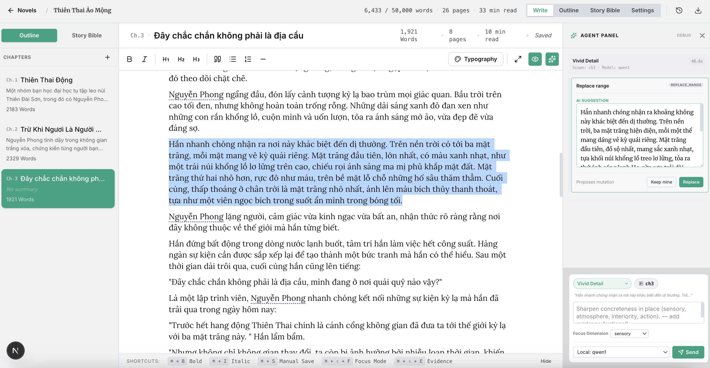
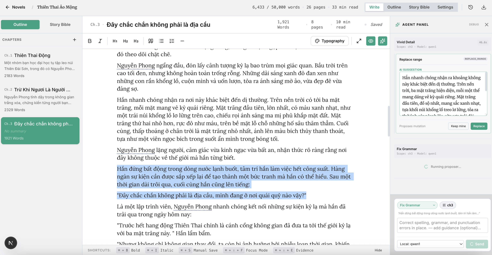

# xnovelist

*[English](#xnovelist) · [Tiếng Việt](#xnovelist--tiếng-việt)*

**Write your novel on your own machine. Own every word. Pay no subscription.**

Most AI novel-writing tools are SaaS, and the meter is always running. The pricing models differ but the shape is the same — a recurring bill and your manuscript on someone else's server:

- **Sudowrite** — a flat monthly subscription, metered in credits.
- **NovelAI** — tiered monthly plans on a token system (with higher tiers for heavier generation).
- **Novelcrafter** — a low monthly platform fee *plus* pay-as-you-go API usage billed by third-party AI providers on top. 

Depending on how much you write and which models you choose, real-world cost can land anywhere from roughly **$5 to $150 a month**.

(These are legitimate tools, and their prices change — check their sites for current numbers.) The common thread: you rent the software, and your draft lives in their cloud.

**xnovelist takes the other path.** The app is free and open-source. It's a folder of HTML, CSS, and JavaScript — no backend, no account, no xnovelist server. Your manuscript lives in your browser's IndexedDB, on your device. For AI, you **bring your own**: plug in your own provider key and pay that provider directly at cost, or point it at a **local model** (Ollama, LM Studio) and pay nothing at all — in which case **nothing ever leaves your computer.**

- **$0 for the app.** Open-source, host it yourself, or open it from a file on disk.
- **AI is optional and yours.** No key, no AI — a complete writing tool. Add a key and pay your provider at cost, or run local and pay nothing.
- **Local-first, privacy-first.** Your prose stays on your device. With a local model the whole loop is offline.
- **Auditable.** It's open source — read it, build it, confirm it isn't phoning home.

---

## Try it now — no install, no account

Not a coder? You don't need to be. Open **[giapnguyen74.github.io/xnovelist](https://giapnguyen74.github.io/xnovelist/)** in any browser and start writing immediately — nothing to download, no sign-up, no setup. It runs entirely in your browser and saves your work to your device. AI stays off until you choose to turn it on (add a provider key in Settings, or point it at a local model).



---

## Two problems, one tool

xnovelist sets out to solve two problems at once:

1. **Cost and ownership.** A writing tool shouldn't be a subscription, and your unpublished manuscript shouldn't live on someone else's server. xnovelist is free, open-source, and local-first (the section above).
2. **The argument about AI in fiction.** Whether AI belongs in novel-writing is a real, unsettled debate — some writers welcome it, others reject it outright, and plenty sit in between. **xnovelist doesn't take a side.** Rather than forcing AI on you or withholding it, it hands you a dial: you choose exactly how far the AI may reach, from nothing at all to a full drafting agent. Not anti-AI, not pro-AI — pro-*your-choice*.

---

## What it is

xnovelist is a serious tool for writing long-form fiction. You can host it on GitHub Pages, on Cloudflare, on a USB stick, or open it straight from your hard drive.

It works **fully without AI**: rich-text editor, chapter outline, Story Bible (characters, locations, voice, continuity), automatic snapshots with line-level diff, find/replace across the manuscript, distraction-free mode, DOCX export. The AI-off experience is the first-class experience, not a stripped-down one.



When you *do* want AI, it's introduced on a dial you control — see "The AI levels" below.

The four product decisions that shape every other choice:

1. **Pure client-side, no server, ever.** Static asset bundle. Deploys to any CDN, opens from `file://`. We do not run a backend and never will.
2. **Mobile, tablet, desktop — same bundle.** Responsive layout; touch interactions are first-class.
3. **Bring your own AI, direct.** OpenAI, OpenRouter, Anthropic, local Ollama, local LM Studio — anything that speaks OpenAI Chat Completions. Your browser talks to the model directly. We host no proxy and hold no key.
4. **Multilingual: UI and prose, independent.** The interface in your language; the AI works in the language your novel is written in. The two settings move separately.

---

## The AI levels

This is how xnovelist stays neutral on the AI debate: AI is **off by default** and governed by a single dial — a workspace **level from 0 to 5** that *you* set. The level is a ceiling on how far the AI may reach into your prose, and it decides which tools exist. Every AI result appears in a right-hand **Agent panel** as a proposal you **accept or reject** — nothing is written to your manuscript or Story Bible without your explicit Accept.

| Level | Name | What the AI does | Whose words reach the page |
|------:|------|------------------|----------------------------|
| **0** | Off | Nothing — no AI, no network calls | 100% yours |
| **1** | Reader | Reads your book: capture characters/locations/style into the Story Bible, summarize a chapter, check continuity | nothing — notes only |
| **2** | Editor | Light-touch edits to text *you selected*: rephrase, fix grammar, shorten, polish dialogue, sharpen detail | your words, refined |
| **3** | Co-writer | Writes a passage inside a beat you outlined *(designed; in progress)* | AI prose, in a slot you defined |
| **4** | Drafter | Drafts a scene you described *(designed)* | a draft awaiting your review |
| **5** | Agent | Bounded, audit-logged work across the whole manuscript *(designed)* | drafts and reports |

The meaningful line is **L2 → L3**: at L2 and below, every word the AI touches was your word first; only at L3+ does it generate new prose. You set the level, and you can lower it any time — drop to 0 and the app is identical to its AI-free self.



Every AI result is a proposal in the Agent panel — you Accept or Reject; nothing touches your manuscript until you do:





---

## Who this is for

If you write novels and want a tool that takes your work as seriously as you do — without forcing AI on you or charging you rent — xnovelist is for you. Two shapes of writer especially:

- **The AI sceptic.** Turn AI off (or never turn it on) and get a first-class, distraction-free writing environment.
- **The disciplined AI-curious.** The level dial and the accept/reject Agent panel keep every AI action named, scoped, and previewed. Nothing about the AI surface is unbounded.

If you want a chat-based ghostwriter, a cloud collaboration suite, or a screenplay tool, xnovelist is the wrong product. See [`docs/NON_GOALS.md`](docs/NON_GOALS.md).

---

## Status

- **v0.1 — AI-free core.** Local-first IndexedDB persistence, safe snapshots, the writing canvas, character/location bible workspaces, DOCX export.
- **v0.2–0.3 — Bring-your-own-AI + the level system.** Provider configuration (OpenAI, Anthropic, OpenRouter, local), connection testing, and the workspace level dial.
- **v0.4–0.7 — The Agent engine, Levels 1 & 2.** A modular AI engine where the model only *proposes* and the app *applies* on your Accept: L1 capture/summary/continuity tools and L2 selection edits, surfaced as accept/reject cards in the Agent panel, with style/continuity-aware context and local guardrails. Levels 3–5 are designed and scaffolded.

Design and decision logs live under [`works/`](works) (the `NN-action.md` slices) and [`docs/`](docs).

---

## Getting started

```bash
npm install
npm run dev      # dev server at http://localhost:3000
npm run build    # static export into out/
```

The built `out/` folder is the entire deployment artefact — host it anywhere, or open `out/index.html` directly.

To use AI, open Settings → AI Connections, set the level to 1+, and add a provider (a cloud key, or a local endpoint like `http://localhost:11434/v1` for Ollama).

---

## Tech stack at a glance

Next.js 15 (static export, `output: "export"`) · React 19 · Tiptap 3 · Tailwind 4 · IndexedDB via `idb` · zod for schema validation · `docx` for export. Build output is a folder of static files — that is the entire deployment artefact. See [`docs/ARCHITECTURE.md`](docs/ARCHITECTURE.md).

---

## The docs pack

Planning, decisions, and concept documents live under `docs/`. First-pass reading order:

1. [`docs/VISION.md`](docs/VISION.md) — what xnovelist is, who it's for, what it isn't
2. [`docs/PRINCIPLES.md`](docs/PRINCIPLES.md) — the design invariants
3. [`docs/ARCHITECTURE.md`](docs/ARCHITECTURE.md) — tech stack, folder structure, module boundaries, i18n
4. [`docs/STORAGE.md`](docs/STORAGE.md) — IndexedDB, schemas, migration, export
5. [`docs/EDITOR.md`](docs/EDITOR.md) — the writing experience without AI
6. [`docs/STORY_BIBLE.md`](docs/STORY_BIBLE.md) — characters, locations, style, continuity
7. [`docs/AI.md`](docs/AI.md) — the general AI design: the level model, BYOAI matrix, the proposer/harness split, prompt architecture, guardrails, privacy
8. [`docs/AI_LEVELS.md`](docs/AI_LEVELS.md) — the per-level tool catalogue (levels 0–5)
9. [`docs/ROADMAP.md`](docs/ROADMAP.md) — milestones and gates
10. [`docs/NON_GOALS.md`](docs/NON_GOALS.md) — explicit cuts, including the no-proxy commitment

If you only read one, read `AI.md` — it captures the most distinctive decisions in the project.

---

## Deployment

A pure client-side static site. Three reference deployments:

- **GitHub Pages (automated).** A workflow at `.github/workflows/deploy.yml` builds and deploys on push to `main`.
- **CDN (Cloudflare Pages, Netlify, S3+CloudFront).** Run `npm run build`, upload `out/`.
- **Local / self-hosted.** Serve `out/` with any static file server (`npx serve out`, Python's `http.server`, `nginx`, `caddy`) — or just open the files.

No environment variables, no secrets, no deploy scripts beyond `npm run build`. The bundle CI builds is the bundle you run.

---

## Privacy

Your manuscript and Story Bible never leave your device on their own. AI calls go from your browser **directly** to the provider you configured — there is no xnovelist proxy and we never see a key or a keystroke. Point AI at a local model and the entire loop is offline. API keys are kept session-only by default and never included in exports.

---

## License

To be determined — the leading candidate is a permissive open-source license (MIT or Apache 2.0) so the local-first promise is fully verifiable: anyone can read the source, build it themselves, and confirm it isn't phoning home.

---
---

# xnovelist — Tiếng Việt

*[English](#xnovelist) · [Tiếng Việt](#xnovelist--tiếng-việt)*

**Viết tiểu thuyết ngay trên máy của bạn. Sở hữu từng con chữ. Không phí thuê bao.**

Hầu hết các công cụ viết tiểu thuyết bằng AI đều là SaaS, và đồng hồ tính tiền luôn chạy. Mô hình giá khác nhau nhưng bản chất giống nhau — một hóa đơn định kỳ và bản thảo của bạn nằm trên máy chủ của người khác:

- **Sudowrite** — thuê bao hàng tháng cố định, tính theo tín dụng (credits).
- **NovelAI** — các gói hàng tháng phân tầng theo hệ thống token (gói cao hơn cho nhu cầu sinh nội dung nhiều hơn).
- **Novelcrafter** — phí nền tảng hàng tháng thấp *cộng thêm* chi phí API trả-theo-mức-dùng do nhà cung cấp AI bên thứ ba tính.

Tùy bạn viết nhiều hay ít và chọn mô hình nào, chi phí thực tế có thể dao động từ khoảng **$5 đến $150 mỗi tháng**.

(Đây đều là những công cụ chính danh, và giá của họ thay đổi — hãy xem trang của họ để biết số liệu hiện tại.) Điểm chung: bạn *thuê* phần mềm, và bản nháp của bạn sống trên đám mây của họ.

**xnovelist đi con đường khác.** Ứng dụng miễn phí và mã nguồn mở. Nó là một thư mục gồm HTML, CSS và JavaScript — không backend, không tài khoản, không máy chủ xnovelist. Bản thảo của bạn nằm trong IndexedDB của trình duyệt, trên thiết bị của bạn. Về AI, bạn **tự mang theo**: cắm khóa (API key) của riêng bạn và trả tiền trực tiếp cho nhà cung cấp theo giá gốc, hoặc trỏ tới một **mô hình chạy cục bộ** (Ollama, LM Studio) và không trả gì cả — khi đó **không gì rời khỏi máy tính của bạn.**

- **$0 cho ứng dụng.** Mã nguồn mở, tự host, hoặc mở trực tiếp từ một tệp trên ổ đĩa.
- **AI là tùy chọn và là của bạn.** Không khóa, không AI — vẫn là một công cụ viết hoàn chỉnh. Thêm khóa và trả theo giá gốc, hoặc chạy cục bộ và không tốn gì.
- **Cục bộ trước tiên, riêng tư trước tiên.** Văn của bạn ở lại trên thiết bị. Với mô hình cục bộ, toàn bộ vòng lặp là ngoại tuyến.
- **Có thể kiểm chứng.** Mã nguồn mở — đọc, tự build, và xác nhận nó không "gọi về nhà".

---

## Dùng thử ngay — không cài đặt, không tài khoản

Không biết lập trình? Không sao cả. Mở **[giapnguyen74.github.io/xnovelist](https://giapnguyen74.github.io/xnovelist/)** trên trình duyệt bất kỳ và bắt đầu viết ngay — không cần tải, không đăng ký, không thiết lập. Nó chạy hoàn toàn trong trình duyệt và lưu việc của bạn trên thiết bị. AI vẫn tắt cho đến khi bạn chọn bật (thêm khóa nhà cung cấp trong Cài đặt, hoặc trỏ tới mô hình cục bộ).


---

## Hai vấn đề, một công cụ

xnovelist đặt mục tiêu giải quyết hai vấn đề cùng lúc:

1. **Chi phí và quyền sở hữu.** Công cụ viết không nên là một gói thuê bao, và bản thảo chưa xuất bản của bạn không nên nằm trên máy chủ của người khác. xnovelist miễn phí, mã nguồn mở và cục-bộ-trước-tiên (phần ở trên).
2. **Cuộc tranh luận về AI trong sáng tác.** Việc AI có nên hiện diện trong viết tiểu thuyết hay không là một tranh luận thật sự, chưa ngã ngũ — có người hoan nghênh, có người phản đối hoàn toàn, và nhiều người ở giữa. **xnovelist không đứng về phía nào.** Thay vì ép bạn dùng AI hay giữ nó lại, nó trao cho bạn một núm xoay: bạn chọn chính xác AI được phép can thiệp tới đâu, từ không gì cả đến một tác nhân soạn thảo đầy đủ. Không chống AI, không ủng hộ AI — ủng hộ *lựa-chọn-của-bạn*.

---

## Nó là gì

xnovelist là một công cụ nghiêm túc để viết tiểu thuyết dài. Bạn có thể host trên GitHub Pages, trên Cloudflare, trên một chiếc USB, hoặc mở thẳng từ ổ cứng.

Nó hoạt động **đầy đủ mà không cần AI**: trình soạn thảo văn bản định dạng, dàn ý chương, Story Bible (nhân vật, địa điểm, giọng văn, mạch liên tục), ảnh chụp nhanh tự động với so sánh theo dòng, tìm/thay trên toàn bản thảo, chế độ tập trung, xuất DOCX. Trải nghiệm không-AI là trải nghiệm hạng nhất, không phải bản bị cắt xén.


Khi bạn *muốn* dùng AI, nó được đưa vào qua một núm xoay bạn kiểm soát — xem "Các cấp độ AI" bên dưới.

Bốn quyết định sản phẩm định hình mọi lựa chọn khác:

1. **Hoàn toàn phía client, không máy chủ, không bao giờ.** Gói tài nguyên tĩnh. Triển khai lên CDN bất kỳ, mở từ `file://`. Chúng tôi không chạy backend và sẽ không bao giờ.
2. **Điện thoại, máy tính bảng, máy để bàn — cùng một gói.** Bố cục đáp ứng; thao tác cảm ứng là hạng nhất.
3. **Tự mang AI của bạn, trực tiếp.** OpenAI, OpenRouter, Anthropic, Ollama cục bộ, LM Studio cục bộ — bất cứ thứ gì nói được giao thức OpenAI Chat Completions. Trình duyệt của bạn nói chuyện trực tiếp với mô hình. Chúng tôi không chạy proxy và không giữ khóa.
4. **Đa ngôn ngữ: giao diện và văn bản, độc lập.** Giao diện theo ngôn ngữ của bạn; AI làm việc bằng ngôn ngữ tiểu thuyết của bạn. Hai thiết lập di chuyển riêng rẽ.

---

## Các cấp độ AI

Đây là cách xnovelist giữ trung lập trong cuộc tranh luận về AI: AI **mặc định tắt** và được điều khiển bằng một núm xoay duy nhất — một **cấp độ từ 0 đến 5** cho workspace mà *bạn* đặt. Cấp độ là trần giới hạn mức AI được vươn tới văn của bạn, và quyết định những công cụ nào tồn tại. Mọi kết quả AI hiện ra trong **Bảng Agent** bên phải dưới dạng đề xuất bạn **chấp nhận hoặc từ chối** — không gì được ghi vào bản thảo hay Story Bible nếu không có nút Chấp nhận của bạn.

| Cấp | Tên | AI làm gì | Chữ của ai lên trang |
|----:|-----|-----------|----------------------|
| **0** | Tắt | Không gì — không AI, không gọi mạng | 100% của bạn |
| **1** | Người đọc | Đọc tác phẩm: thu thập nhân vật/địa điểm/phong cách vào Story Bible, tóm tắt chương, kiểm tra mạch liên tục | không gì — chỉ ghi chú |
| **2** | Biên tập | Chỉnh sửa nhẹ trên đoạn *bạn chọn*: diễn đạt lại, sửa ngữ pháp, rút gọn, trau chuốt hội thoại, làm sắc chi tiết | chữ của bạn, được mài giũa |
| **3** | Đồng tác giả | Viết một đoạn trong một beat bạn đã phác *(đã thiết kế; đang làm)* | văn AI, trong khe bạn định nghĩa |
| **4** | Người soạn nháp | Soạn nháp một cảnh bạn mô tả *(đã thiết kế)* | bản nháp chờ bạn duyệt |
| **5** | Tác nhân | Làm việc trên toàn bản thảo, có giới hạn và ghi nhật ký *(đã thiết kế)* | bản nháp và báo cáo |

Lằn ranh quan trọng là **Cấp 2 → Cấp 3**: ở Cấp 2 trở xuống, mọi từ AI chạm vào đều vốn là từ của bạn; chỉ từ Cấp 3 trở lên AI mới sinh ra văn mới. Bạn đặt cấp độ, và có thể hạ xuống bất cứ lúc nào — về 0 thì ứng dụng giống hệt phiên bản không-AI.


Mọi kết quả AI là một đề xuất trong Bảng Agent — bạn Chấp nhận hoặc Từ chối; không gì chạm vào bản thảo cho đến khi bạn làm vậy:


---

## Dành cho ai

Nếu bạn viết tiểu thuyết và muốn một công cụ coi trọng tác phẩm của bạn như chính bạn — mà không ép bạn dùng AI hay bắt bạn trả phí thuê — thì xnovelist là dành cho bạn. Đặc biệt là hai kiểu người viết:

- **Người hoài nghi AI.** Tắt AI (hoặc không bao giờ bật) và có một môi trường viết hạng nhất, không phân tâm.
- **Người tò mò AI nhưng có kỷ luật.** Núm xoay cấp độ và Bảng Agent chấp nhận/từ chối giữ cho mọi hành động AI đều được đặt tên, giới hạn phạm vi và xem trước. Không có gì về mặt AI là vô giới hạn.

Nếu bạn muốn một "người viết thuê" dạng chat, một bộ cộng tác trên đám mây, hay công cụ viết kịch bản, thì xnovelist không phải sản phẩm dành cho bạn. Xem [`docs/NON_GOALS.md`](docs/NON_GOALS.md).

---

## Tình trạng

- **v0.1 — Lõi không-AI.** Lưu trữ cục bộ bằng IndexedDB, ảnh chụp nhanh an toàn, khung soạn thảo, không gian Story Bible cho nhân vật/địa điểm, xuất DOCX.
- **v0.2–0.3 — Tự-mang-AI + hệ thống cấp độ.** Cấu hình nhà cung cấp (OpenAI, Anthropic, OpenRouter, cục bộ), kiểm tra kết nối, và núm xoay cấp độ.
- **v0.4–0.7 — Engine Agent, Cấp 1 & 2.** Một engine AI mô-đun hóa, nơi mô hình chỉ *đề xuất* còn ứng dụng *áp dụng* khi bạn Chấp nhận: các công cụ Cấp 1 (thu thập/tóm tắt/kiểm tra mạch liên tục) và chỉnh sửa đoạn chọn ở Cấp 2, hiện ra dưới dạng thẻ chấp nhận/từ chối trong Bảng Agent, với ngữ cảnh nhận biết phong cách/mạch liên tục và các kiểm tra cục bộ. Cấp 3–5 đã được thiết kế và dựng khung.

Nhật ký thiết kế và quyết định nằm trong [`works/`](works) (các lát cắt `NN-action.md`) và [`docs/`](docs).

---

## Bắt đầu

```bash
npm install
npm run dev      # máy chủ dev tại http://localhost:3000
npm run build    # xuất tĩnh vào out/
```

Thư mục `out/` đã build là toàn bộ sản phẩm triển khai — host ở đâu cũng được, hoặc mở `out/index.html` trực tiếp.

Để dùng AI, mở Cài đặt → AI Connections, đặt cấp độ ≥ 1, và thêm một nhà cung cấp (khóa đám mây, hoặc một endpoint cục bộ như `http://localhost:11434/v1` cho Ollama).

---

## Công nghệ tổng quan

Next.js 15 (xuất tĩnh, `output: "export"`) · React 19 · Tiptap 3 · Tailwind 4 · IndexedDB qua `idb` · zod để kiểm tra schema · `docx` để xuất. Kết quả build là một thư mục tệp tĩnh — đó là toàn bộ sản phẩm triển khai. Xem [`docs/ARCHITECTURE.md`](docs/ARCHITECTURE.md).

---

## Bộ tài liệu

Tài liệu kế hoạch, quyết định và ý tưởng nằm trong `docs/`. Thứ tự đọc lần đầu:

1. [`docs/VISION.md`](docs/VISION.md) — xnovelist là gì, dành cho ai, không phải là gì
2. [`docs/PRINCIPLES.md`](docs/PRINCIPLES.md) — các nguyên tắc bất biến trong thiết kế
3. [`docs/ARCHITECTURE.md`](docs/ARCHITECTURE.md) — công nghệ, cấu trúc thư mục, ranh giới mô-đun, i18n
4. [`docs/STORAGE.md`](docs/STORAGE.md) — IndexedDB, schema, di trú, xuất
5. [`docs/EDITOR.md`](docs/EDITOR.md) — trải nghiệm viết khi không có AI
6. [`docs/STORY_BIBLE.md`](docs/STORY_BIBLE.md) — nhân vật, địa điểm, phong cách, mạch liên tục
7. [`docs/AI.md`](docs/AI.md) — thiết kế AI tổng quát: mô hình cấp độ, ma trận BYOAI, phân tách "đề xuất/khung điều phối", kiến trúc prompt, lan can an toàn, quyền riêng tư
8. [`docs/AI_LEVELS.md`](docs/AI_LEVELS.md) — danh mục công cụ theo từng cấp (cấp 0–5)
9. [`docs/ROADMAP.md`](docs/ROADMAP.md) — cột mốc và điều kiện
10. [`docs/NON_GOALS.md`](docs/NON_GOALS.md) — những gì chủ động không làm, gồm cam kết không-proxy

Nếu chỉ đọc một tài liệu, hãy đọc `AI.md` — nó nắm những quyết định đặc trưng nhất của dự án.

---

## Triển khai

Một trang tĩnh hoàn toàn phía client. Ba cách triển khai tham khảo:

- **GitHub Pages (tự động).** Một workflow tại `.github/workflows/deploy.yml` sẽ build và triển khai khi đẩy lên nhánh `main`.
- **CDN (Cloudflare Pages, Netlify, S3+CloudFront).** Chạy `npm run build`, tải lên thư mục `out/`.
- **Cục bộ / tự host.** Phục vụ thư mục `out/` bằng máy chủ tệp tĩnh bất kỳ (`npx serve out`, `http.server` của Python, `nginx`, `caddy`) — hoặc chỉ cần mở các tệp.

Không biến môi trường, không bí mật, không script triển khai nào ngoài `npm run build`. Gói mà CI build ra chính là gói bạn chạy.

---

## Quyền riêng tư

Bản thảo và Story Bible của bạn không tự rời khỏi thiết bị. Các lệnh gọi AI đi **trực tiếp** từ trình duyệt của bạn tới nhà cung cấp bạn đã cấu hình — không có proxy của xnovelist và chúng tôi không bao giờ thấy khóa hay từng phím gõ. Trỏ AI tới mô hình cục bộ thì toàn bộ vòng lặp là ngoại tuyến. Khóa API mặc định chỉ giữ trong phiên và không bao giờ được đưa vào bản xuất.

---

## Giấy phép

Chưa quyết định — ứng viên hàng đầu là một giấy phép mã nguồn mở dễ chịu (MIT hoặc Apache 2.0) để lời hứa cục-bộ-trước-tiên hoàn toàn có thể kiểm chứng: ai cũng đọc được mã nguồn, tự build, và xác nhận nó không "gọi về nhà".
